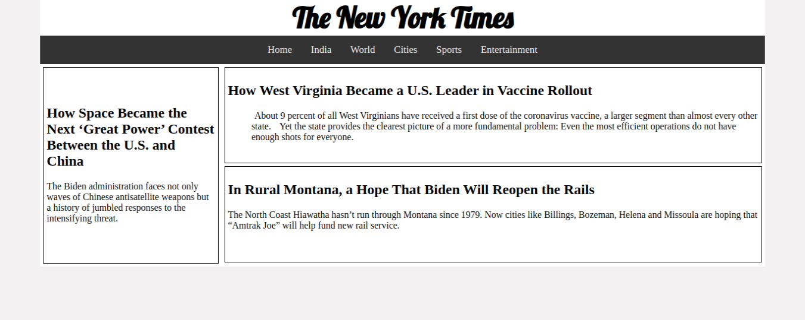
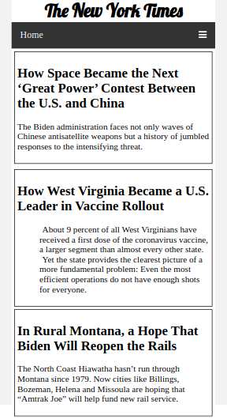

## Layout Shifter Pattern Challenge

## Context

Responsive Design patterns are used to make a web page responsive across various devices of varying screen sizes.Most design patterns will use breakpoints to adapt for different screen sizes. A Breakpoint is the point at which a different CSS will be applied, usually through a media query, to optimize the design for the user’s viewport. A good example of a breakpoint would be one where your layout has to change from two columns to four columns from one device to another.

The layout shifter pattern is the most responsive pattern, with multiple breakpoints across several screen widths.

The Key difference to this layout is the way content moves about, instead of reflowing and dropping below other columns. Due to the significant differences between each major breakpoint, it is more complex to maintain and likely involves changes within elements, not just overall content layout.

This pattern does the most to adapt across different screen sizes and hence inherently requires more work. That is, different layouts are used on large, medium, and small screens.

## Challenge

Create a Web Page which changes the layout at every break point on multiple screen sizes using Layout Shifter Pattern matching the following images.

**Desktop View**



**Tab View**


**Mobile View**



**Mobile Menu Navigation Image**


## Details
1. All the assets required can be found in the `./assets` folder
2. Few texts which have been used in this page
```
How Space Became the Next ‘Great Power’ Contest Between the U.S. and China

The Biden administration faces not only waves of Chinese antisatellite weapons but a history of jumbled responses to the intensifying threat

How West Virginia Became a U.S. Leader in Vaccine Rollout

About 9 percent of all West Virginians have received a first dose of the coronavirus vaccine, a larger segment than almost every other state.

Yet the state provides the clearest picture of a more fundamental problem: Even the most efficient operations do not have enough shots for everyone.

In Rural Montana, a Hope That Biden Will Reopen the Rails.

The North Coast Hiawatha hasn’t run through Montana since 1979. Now cities like Billings, Bozeman, Helena and Missoula are hoping that “Amtrak Joe” will help fund new rail service.

```
